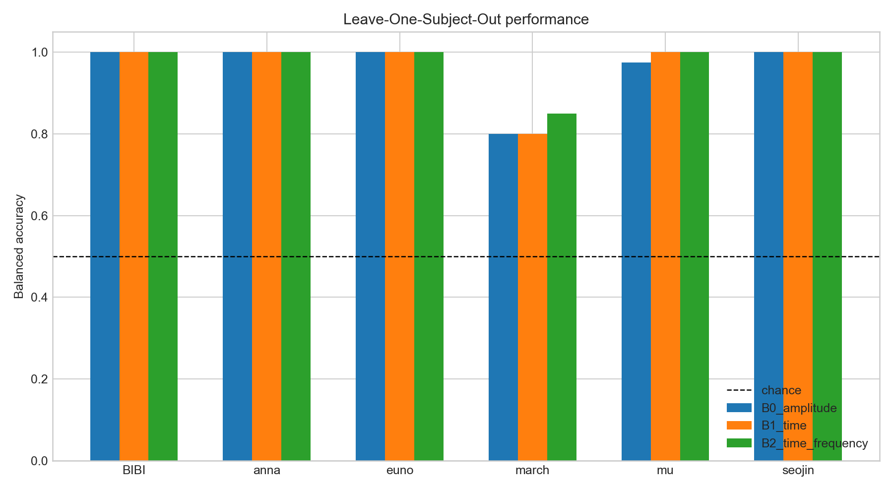
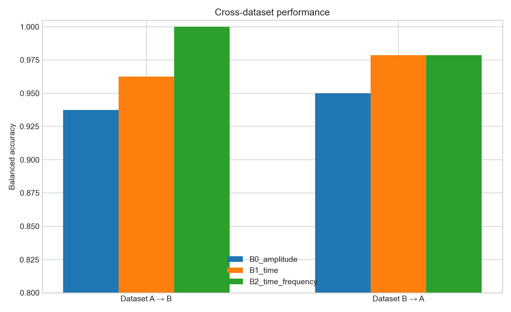
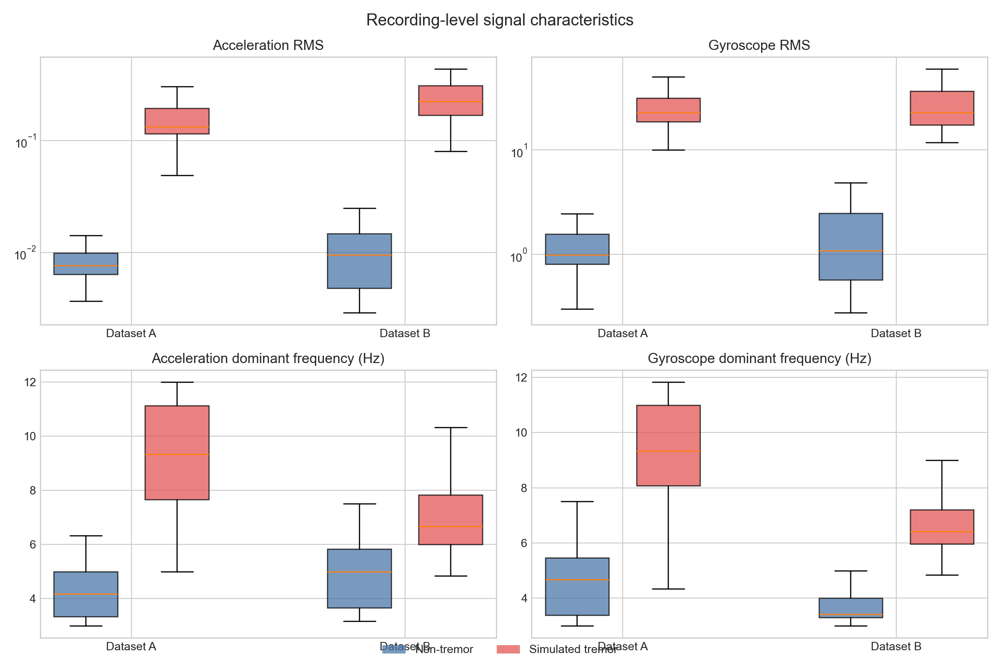

# 1차 베이스라인 분석

## 분석 목적

다음 연구 질문을 복잡한 딥러닝 모델보다 먼저 해석 가능한 베이스라인으로 검토했다.

> 주파수 정보를 명시적으로 활용하면 소규모 IMU 기반 모사 떨림 탐지 모델의 새로운 참가자 및 새로운 수집 조건에 대한 일반화 성능이 향상되는가?

이 결과는 건강한 참가자가 자발적으로 모사한 떨림과 non-tremor를 구분한 결과이며 임상적 떨림 탐지 성능이 아니다.

## 데이터와 전처리

- 총 220 recordings, 6 participants
- Simulated tremor 110 recordings, non-tremor 110 recordings
- 모든 recording을 50 Hz로 리샘플링
- 3초 윈도우, 50% overlap
- 100 ms를 초과하는 원본 sampling gap을 가로지르는 윈도우 제외
- 2,614개 윈도우 사용, 26개 윈도우 제외
- `angle_*` 채널 제외
- 가속도계와 자이로스코프의 3축 평균을 각각 제거
- 진폭·시간 특징에는 3축 vector magnitude 사용
- 주파수 특징에는 magnitude가 아니라 3축 PSD의 합을 사용

마지막 항목은 중요하다. Vector magnitude에 직접 PSD를 적용하면 절댓값 효과로 진동 주파수가 배가되거나 왜곡될 수 있기 때문이다.

## 비교 모델

세 모델 모두 고정된 `C=1.0`, class-balanced logistic regression과 training fold에서만 적합한 standardization을 사용했다.

- **B0 amplitude:** 가속도 및 자이로스코프 RMS만 사용
- **B1 time:** RMS, standard deviation, MAD, jerk RMS, zero-crossing rate 사용
- **B2 time+frequency:** B1에 3-12 Hz log power, dominant frequency, peak ratio, spectral entropy, tremor/total power ratio 및 세부 대역 power ratio 추가

모델 구조와 tuning budget을 동일하게 유지했으므로 B1과 B2의 차이가 명시적 주파수 정보의 기여도를 보는 주 비교이다.

## 결과

### Leave-One-Subject-Out

| 모델 | 평균 balanced accuracy | 표준편차 | 평균 sensitivity | 평균 specificity |
| --- | ---: | ---: | ---: | ---: |
| B0 amplitude | 0.9625 | 0.0802 | 0.9333 | 0.9917 |
| B1 time | 0.9667 | 0.0816 | 0.9333 | 1.0000 |
| B2 time+frequency | 0.9750 | 0.0612 | 0.9500 | 1.0000 |

B2는 B1보다 LOSO 평균 balanced accuracy가 0.83 percentage points 높았다. 참가자가 6명뿐이고 개선이 한 참가자의 recording 한 건 차이에 해당하므로 강한 일반화 근거로 해석해서는 안 된다.

가장 어려운 참가자는 `march`였다. B0과 B1은 0.80, B2는 0.85 balanced accuracy였고, 오류는 모두 simulated tremor를 non-tremor로 판단한 false negative였다.



### Cross-dataset

| 학습 → 평가 | B0 amplitude | B1 time | B2 time+frequency |
| --- | ---: | ---: | ---: |
| Dataset A → Dataset B | 0.9375 | 0.9625 | **1.0000** |
| Dataset B → Dataset A | 0.9500 | **0.9786** | **0.9786** |
| 두 방향 평균 | 0.9438 | 0.9705 | **0.9893** |

주파수 특징을 추가한 B2는 B1보다 A→B에서 3.75 percentage points 높았고 B→A에서는 같았다. 두 방향 평균 개선은 약 1.88 percentage points이다.



## 신호 수준 관찰

Recording별 윈도우 중앙값을 다시 집계하면 다음과 같다.

| 특징 | Dataset A non-tremor | Dataset A tremor | Dataset B non-tremor | Dataset B tremor |
| --- | ---: | ---: | ---: | ---: |
| Acceleration RMS | 0.0077 g | 0.1328 g | 0.0095 g | 0.2243 g |
| Gyroscope RMS | 0.9955 dps | 22.8449 dps | 1.0893 dps | 22.9119 dps |
| Acceleration dominant frequency | 4.17 Hz | 9.33 Hz | 5.00 Hz | 6.67 Hz |
| Gyroscope dominant frequency | 4.67 Hz | 9.33 Hz | 3.42 Hz | 6.42 Hz |

진폭 차이가 매우 커 B0만으로도 높은 성능이 나온다. 동시에 tremor dominant frequency는 Dataset A에서 약 9.3 Hz, Dataset B에서 약 6.3-6.6 Hz로 달라 명확한 frequency-domain shift가 존재한다.



## 1차 결론

현재 결과는 연구 가설을 **부분적으로 지지**한다.

- **Subject-independent:** 주파수 정보는 time-only 모델보다 평균 0.83 percentage points 높았지만 한 참가자의 recording 한 건 차이에 불과했다.
- **Cross-dataset:** 주파수 정보는 A→B에서 개선됐고 B→A에서는 같은 balanced accuracy를 기록했다.
- **해석:** 명시적 주파수 정보는 새로운 사람보다 새로운 수집 조건으로의 일반화에서 더 유용할 가능성이 있다.

다만 참가자가 6명뿐이고 진폭만으로도 거의 분리되므로, 작은 개선을 일반적 효과로 주장하기에는 근거가 부족하다. 이 결과는 탐색적 1차 결과로 취급해야 한다.

## 다음 분석

1. 참가자별 confidence와 calibration을 비교해 B1과 B2가 같은 hard prediction을 내더라도 ranking 또는 confidence가 달라지는지 확인한다.
2. Acceleration-only, gyroscope-only, both ablation을 수행한다.
3. 2초, 3초, 5초 윈도우 sensitivity analysis를 수행한다.
4. Dataset-ID prediction control로 특징에 남아 있는 domain information을 측정한다.
5. Mean/max/attention pooling 전에 recording 내 tremor intermittency를 정량화한다.
6. 위 결과 이후에만 compact 1D CNN과 dual-view frequency-aware model을 비교한다.

## 재현 방법

```bash
python3.12 -m venv .venv
.venv/bin/python -m pip install -r requirements.txt
MPLCONFIGDIR=/tmp/ada_iot_mpl .venv/bin/python scripts/run_baseline_analysis.py
```

정량 결과는 `baseline_metrics.csv`, recording-level 예측은 `baseline_predictions.csv`, 추출 특징은 `recording_features.csv`에 저장된다.
