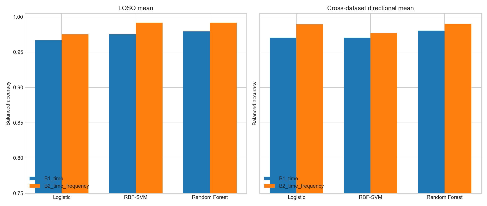

# RBF-SVM 및 Random Forest 비선형 베이스라인

## 목적

선형 Logistic Regression에서 관측된 결과가 분류기의 선형 결정경계에 제한된 것인지 확인하기 위해 RBF-SVM과 Random Forest를 비교했다.

분류기만 교체하고 나머지 조건은 1차 주분석과 동일하게 유지했다.

- 공통 sampling rate: 50 Hz
- Window: 3초, 50% overlap
- Sensor: accelerometer와 gyroscope 모두 사용
- Unit of prediction: recording
- Evaluation: 6-fold Leave-One-Subject-Out 및 양방향 cross-dataset
- Feature sets: B1 time-only, B2 time+frequency
- Hyperparameter search: 수행하지 않음

Test 결과를 보고 hyperparameter를 선택하는 것을 막기 위해 모든 설정을 실행 전에 고정했다.

## 모델 설정

### RBF-SVM

```python
StandardScaler()
SVC(
    kernel="rbf",
    C=1.0,
    gamma="scale",
    class_weight="balanced",
    probability=True,
    random_state=42,
)
```

RBF kernel은 특징 사이의 비선형 경계를 학습한다. Scaling은 training fold에서만 적합했다. `probability=True`로 training data 내부에서 확률 보정을 수행해 AUROC와 AUPRC를 계산했다.

### Random Forest

```python
RandomForestClassifier(
    n_estimators=500,
    max_features="sqrt",
    min_samples_leaf=2,
    class_weight="balanced",
    random_state=42,
    n_jobs=-1,
)
```

500개 tree를 사용했으며 `min_samples_leaf=2`로 단일 recording에 지나치게 맞는 분기를 제한했다. Random Forest는 scaling에 영향을 받지 않지만 동일한 평가 pipeline을 유지했다.

## 사용한 특징

### B1 time-only

- RMS
- Standard deviation
- Median absolute deviation
- Jerk RMS
- Zero-crossing rate
- 각 recording 내 3초 윈도우 특징의 median과 IQR

### B2 time+frequency

B1에 다음 특징을 추가했다.

- 3-12 Hz log power
- Dominant frequency
- Peak-to-band-power ratio
- Spectral entropy
- 3-12 Hz / 0.5-20 Hz power ratio
- 3-6 Hz, 6-9 Hz, 9-12 Hz power ratio

주파수 특징은 vector magnitude가 아니라 가속도 및 자이로의 3축 Welch PSD를 합산해 계산했다.

## 결과

### Leave-One-Subject-Out

| 분류기 | 특징 | 평균 balanced accuracy | 표준편차 | Sensitivity | Specificity |
| --- | --- | ---: | ---: | ---: | ---: |
| Logistic Regression | B1 time | 0.9667 | 0.0816 | 0.9333 | 1.0000 |
| Logistic Regression | B2 time+frequency | 0.9750 | 0.0612 | 0.9500 | 1.0000 |
| RBF-SVM | B1 time | 0.9750 | 0.0418 | 0.9667 | 0.9833 |
| RBF-SVM | B2 time+frequency | **0.9917** | 0.0204 | **1.0000** | 0.9833 |
| Random Forest | B1 time | 0.9792 | 0.0401 | 0.9667 | 0.9917 |
| Random Forest | B2 time+frequency | **0.9917** | 0.0204 | 0.9833 | **1.0000** |

RBF-SVM과 Random Forest 모두 B2에서 평균 0.9917을 기록했다. 두 모델 모두 전체 LOSO 예측에서 한 recording만 오분류했지만 오류 유형은 달랐다.

- RBF-SVM: BIBI의 non-tremor 한 건을 tremor로 분류
- Random Forest: march의 simulated tremor 한 건을 non-tremor로 분류

### Cross-dataset

| 분류기 | 특징 | A → B | B → A | 두 방향 평균 |
| --- | --- | ---: | ---: | ---: |
| Logistic Regression | B1 time | 0.9625 | 0.9786 | 0.9705 |
| Logistic Regression | B2 time+frequency | **1.0000** | 0.9786 | 0.9893 |
| RBF-SVM | B1 time | 0.9625 | 0.9786 | 0.9705 |
| RBF-SVM | B2 time+frequency | 0.9750 | 0.9786 | 0.9768 |
| Random Forest | B1 time | 0.9750 | 0.9857 | 0.9804 |
| Random Forest | B2 time+frequency | 0.9875 | **0.9929** | **0.9902** |

Random Forest B2의 cross-dataset 평균이 0.9902로 가장 높았다. 그러나 Logistic Regression B2의 0.9893보다 단 0.09 percentage points 높은 수준이며, 표본 수를 고려하면 실질적으로 의미 있는 우위라고 말할 수 없다.

RBF-SVM B2는 0.9768로 Logistic Regression B2보다 낮았다. 따라서 더 유연한 비선형 결정경계가 자동으로 sampling-condition shift에 강해지는 것은 아니다.



## 결론

1. 비선형 모델은 subject-independent 성능에서 선형 Logistic Regression보다 높은 결과를 보였다.
2. Random Forest는 B1과 B2 모두에서 안정적으로 높은 성능을 보였고, B2가 전체 cross-dataset 평균 최고였다.
3. RBF-SVM은 LOSO에서는 강했지만 cross-dataset에서는 frequency-aware Logistic Regression과 Random Forest보다 낮았다.
4. 세 분류기 모두 B2가 B1보다 높아, 두 센서를 함께 사용하는 3초 조건에서는 주파수 특징의 추가 가치가 다시 관측됐다.
5. 데이터가 매우 쉽게 분리되고 모델 간 오분류 차이가 1-3건 수준이므로 성능 순위를 과도하게 해석하면 안 된다.

현재 단계에서 가장 타당한 classical baseline은 다음 두 가지다.

- 해석 가능 기준: Logistic Regression + B2
- 비선형 기준: Random Forest + B2

RBF-SVM은 비교 대상으로 유지하되 최종 대표 모델로 선택할 근거는 부족하다.

## 재현 방법

먼저 3초 recording 특징이 생성되어 있어야 한다.

```bash
MPLCONFIGDIR=/tmp/ada_iot_mpl .venv/bin/python scripts/run_sensitivity_analysis.py
MPLCONFIGDIR=/tmp/ada_iot_mpl .venv/bin/python scripts/run_nonlinear_baselines.py
```

세부 fold 지표는 `nonlinear_metrics.csv`, recording별 예측 확률은 `nonlinear_predictions.csv`에 저장된다.
