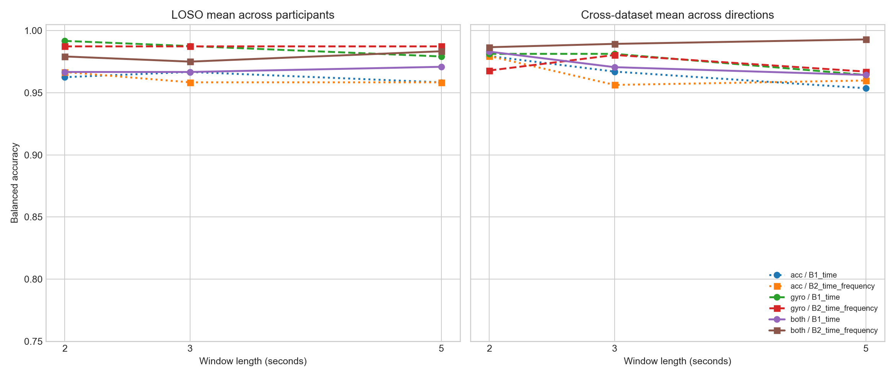

# 센서 및 윈도우 길이 민감도 분석

## 목적

1차 분석에서 사용한 3초 윈도우와 두 센서 조합에 결과가 종속되는지 확인하기 위해 다음 조건을 비교했다.

- Window length: 2초, 3초, 5초
- Sensor: accelerometer only, gyroscope only, both
- Feature set: time-only(B1), time+frequency(B2)
- Evaluation: Leave-One-Subject-Out와 양방향 cross-dataset

모든 조건은 같은 logistic regression, 같은 scaling 원칙과 같은 recording-level split을 사용했다.

## 평균 balanced accuracy

### Leave-One-Subject-Out

| 윈도우 | Acc B1 | Acc B2 | Gyro B1 | Gyro B2 | Both B1 | Both B2 |
| ---: | ---: | ---: | ---: | ---: | ---: | ---: |
| 2초 | 0.9625 | 0.9667 | **0.9917** | 0.9875 | 0.9667 | 0.9792 |
| 3초 | 0.9667 | 0.9583 | **0.9875** | **0.9875** | 0.9667 | 0.9750 |
| 5초 | 0.9583 | 0.9583 | 0.9792 | 0.9875 | 0.9708 | 0.9833 |

LOSO 최고 결과는 2초 gyroscope time-only의 0.9917이었다. Gyroscope만으로도 매우 강하며, 주파수 특징이 센서와 윈도우 조건마다 항상 개선을 제공하지는 않았다.

### Cross-dataset

| 윈도우 | Acc B1 | Acc B2 | Gyro B1 | Gyro B2 | Both B1 | Both B2 |
| ---: | ---: | ---: | ---: | ---: | ---: | ---: |
| 2초 | 0.9795 | 0.9795 | 0.9812 | 0.9679 | 0.9830 | 0.9866 |
| 3초 | 0.9670 | 0.9562 | 0.9812 | 0.9804 | 0.9705 | 0.9893 |
| 5초 | 0.9536 | 0.9598 | 0.9643 | 0.9670 | 0.9643 | **0.9929** |

Cross-dataset 최고 결과는 5초, 두 센서, time+frequency의 0.9929였다. 두 센서를 함께 사용할 때는 세 윈도우 길이 모두 B2가 B1보다 높았다. 반면 단일 센서에서는 주파수 특징의 효과가 일관되지 않았다.

## 해석

주파수 특징의 효과는 단순한 독립적 주효과라기보다 **센서 결합과 윈도우 길이에 따른 상호작용**으로 보인다.

- 참가자 일반화에서는 짧은 2초 자이로 time-only 모델이 가장 높았다.
- 데이터셋 일반화에서는 긴 5초 윈도우에서 두 센서와 주파수 정보를 함께 사용할 때 가장 높았다.
- Accelerometer-only 또는 gyroscope-only에서는 B2가 B1보다 낮아지는 조건도 있었다.
- 그러므로 “주파수 정보를 추가하면 항상 개선된다”는 주장은 현재 결과로 지지되지 않는다.
- 더 방어 가능한 결론은 “가속도와 자이로를 결합한 모델에서 명시적 주파수 정보가 cross-dataset 일반화에 도움이 될 가능성이 있다”이다.

## 모델 선택 제안

다음 딥러닝 비교의 사전 지정 조건으로 다음 두 구성을 사용한다.

1. **Subject-independent 중심:** 2초 gyroscope 또는 2초 두 센서 입력
2. **Cross-dataset 중심:** 5초 두 센서 dual-view time+frequency 입력

그러나 최고 점수를 보고 조건을 확정하면 selection bias가 생긴다. 따라서 3초·두 센서 조건을 주분석으로 유지하고 2초와 5초 결과는 sensitivity analysis로 보고하는 것이 더 타당하다.

## 다음 단계

- Recording 내부 window별 3-12 Hz power 분포로 intermittency 측정
- Mean/max/attention pooling 비교 필요성 판단
- Dataset-ID prediction control
- Participant별 오분류 recording의 원신호 및 PSD 검토
- 이후 compact 1D CNN과 dual-view frequency-aware encoder 비교
